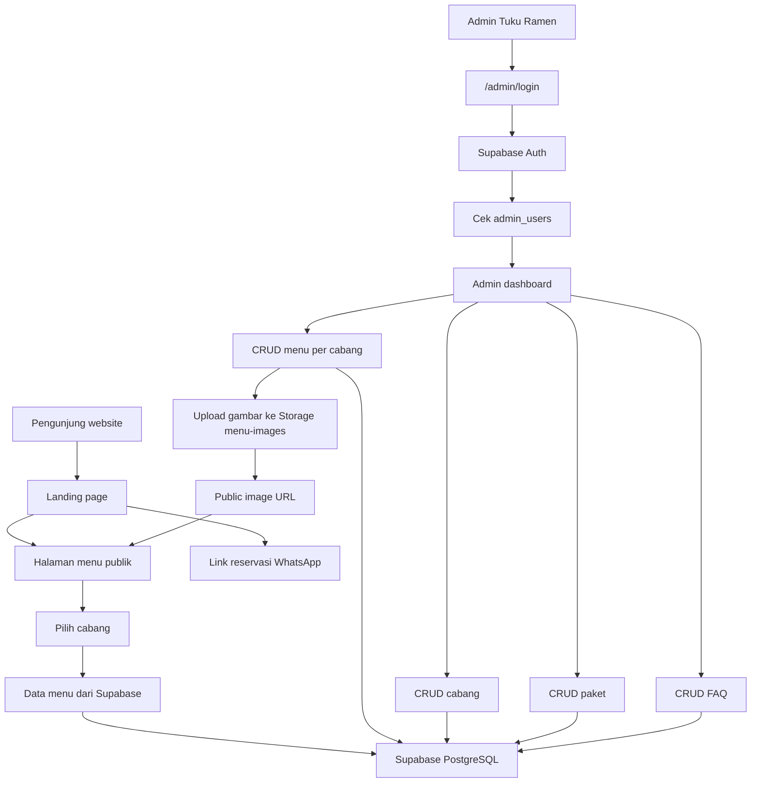
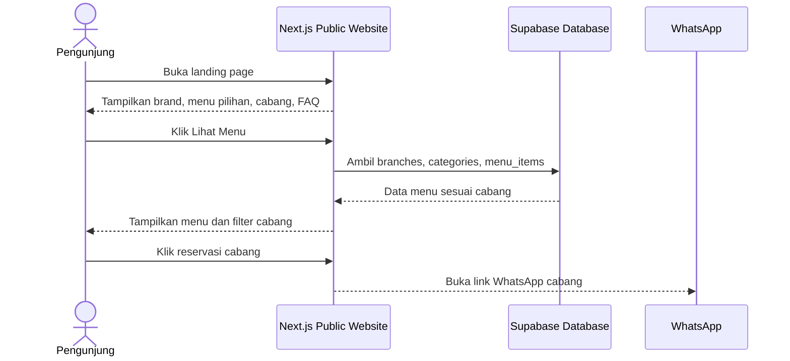
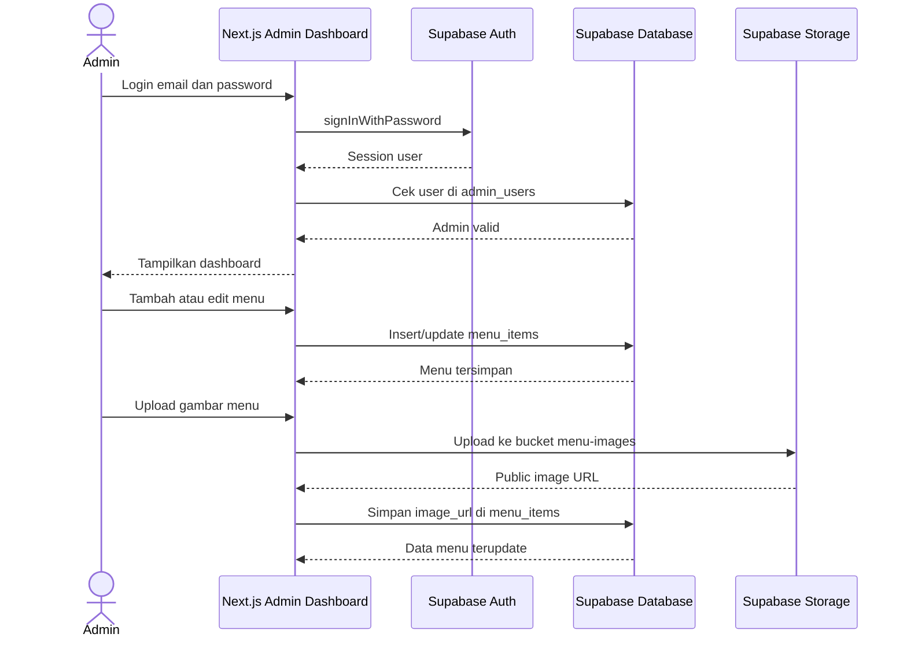

# Tuku Ramen Website

Website dan admin dashboard untuk Tuku Ramen. Aplikasi ini memakai Next.js App Router, Supabase Auth, Supabase Database, dan Supabase Storage untuk mengelola landing page, menu per cabang, paket, FAQ, serta gambar menu.

## Fitur Utama

- Landing page mobile-first dengan informasi brand, menu pilihan, paket, cabang, FAQ, dan CTA reservasi.
- Halaman menu publik dengan filter cabang `ciputat` dan `pondok-ranji`.
- Admin dashboard untuk CRUD cabang, menu, paket, dan FAQ.
- Menu dapat dibedakan per cabang karena `menu_items` terhubung ke `branches`.
- Upload gambar menu ke Supabase Storage bucket `menu-images`.
- Proteksi admin memakai Supabase Auth, RLS, dan allowlist tabel `admin_users`.

## Diagram Alur Sistem



## Sequence Diagram





## Struktur Penting

```txt
src/app/(public)/page.tsx       Landing page
src/app/(public)/menu/page.tsx  Menu publik per cabang
src/app/admin/                  Admin dashboard
src/components/ui/              Komponen UI publik
src/lib/supabase/               Supabase client/server/proxy helper
src/lib/types/database.ts       Type dan fallback data
src/proxy.ts                    Proteksi route admin
supabase-schema.sql             Schema database awal
supabase-complete-menu-seed.sql Seed menu lengkap
supabase-production-admin-security.sql RLS admin allowlist
```

## Setup Development

Install dependency:

```bash
npm install
```

Buat file `.env.local` dari contoh:

```bash
cp .env.example .env.local
```

Isi dengan konfigurasi Supabase project:

```env
NEXT_PUBLIC_SUPABASE_URL=
NEXT_PUBLIC_SUPABASE_ANON_KEY=
```

Jalankan development server:

```bash
npm run dev
```

Script `dev` memakai webpack agar lebih ringan untuk laptop development. Kalau ingin mencoba Turbopack:

```bash
npm run dev:turbo
```

## Setup Supabase

Jalankan SQL berikut di Supabase SQL Editor sesuai kebutuhan:

1. `supabase-schema.sql` untuk membuat tabel dasar.
2. `supabase-complete-menu-seed.sql` untuk mengisi data menu, cabang, topping, dan paket.
3. `supabase-production-admin-security.sql` untuk policy RLS, tabel `admin_users`, dan storage policy.

Sebelum menjalankan file security, pastikan user admin sudah dibuat di Supabase Authentication. Default script memakai:

```sql
WHERE email = 'admin@tukuramen.com'
```

Ganti email tersebut jika akun admin development memakai email lain.

## Storage Gambar Menu

Bucket yang dipakai:

```txt
menu-images
```

Bucket ini harus public agar gambar menu dapat tampil di website. Policy upload/update/delete tetap dibatasi oleh `public.is_admin()` dari `supabase-production-admin-security.sql`.

## Keamanan

- `.env.local` dan semua file `.env*` tidak ikut commit.
- Hanya `.env.example` yang boleh masuk repository.
- Admin dashboard tidak cukup hanya login; user juga harus ada di tabel `admin_users`.
- RLS public hanya mengizinkan read untuk data website.
- Write access untuk tabel admin dan storage dibatasi ke admin allowlist.
- Jangan commit service role key Supabase ke frontend atau repository.

## Perintah Validasi

```bash
npm run lint
npm run build
```

Saat ini lint dapat menampilkan warning Next.js untuk penggunaan `` pada preview gambar menu. Warning tersebut tidak memblokir build.

## Deployment

Untuk deployment ke Vercel atau hosting Next.js lain:

1. Set environment variable `NEXT_PUBLIC_SUPABASE_URL`.
2. Set environment variable `NEXT_PUBLIC_SUPABASE_ANON_KEY`.
3. Pastikan SQL schema, seed, security policy, dan bucket `menu-images` sudah tersedia di Supabase.
4. Jalankan build production:

```bash
npm run build
```
